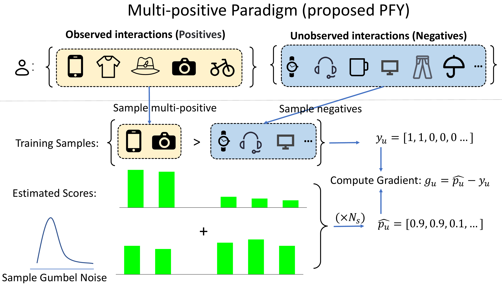

# Perturbed Fenchel-Young Loss for Recommendation

PyTorch code for training recommendation models with a multi-positive
Perturbed Fenchel-Young (PFY) objective.

## Overview

Most implicit-feedback losses train on one positive item at a time. PFY uses
a set of `P` distinct positives from the same user and treats recommendation
as a structured Top-P decision.

The training paradigm is summarized below.



Let `s` be the model scores over the item catalog and let `y` be the P-hot
target. The feasible set is

$$
\mathcal{C}_P = \{z \in \{0,1\}^{|\mathcal{I}|} : \mathbf{1}^{\top}z=P\}.
$$

After adding independent Gumbel noise, the perturbed potential is

$$
W_{P,\epsilon}(s)=\mathbb{E}_{g}\left[\max_{z\in\mathcal{C}_P}\langle s+\epsilon g,z\rangle\right].
$$

Terms that depend only on the target can be omitted during optimization, so
the implemented objective is

$$
\widetilde{\mathcal{L}}(s,y)=W_{P,\epsilon}(s)-\langle s,y\rangle.
$$

Its score gradient is the difference between the expected hard Top-P
selection and the P-hot target:

$$
\nabla_s\widetilde{\mathcal{L}}(s,y)=\mathbb{E}_{g}[z^{\star}(s,g)]-y.
$$

The expectation is estimated by Monte Carlo sampling. Every sample uses an
exact hard Top-P operation. There is no continuous relaxation or
straight-through estimator.

## Code

- `losses/gumbel_pfy.py` implements the PFY objective.
- `models.py` provides MF, LightGCN, and XSimGCL backbones.
- `data.py` loads implicit-feedback splits and samples distinct positives.
- `trainer.py` contains the shared training and checkpoint loop.
- `metrics.py` implements full-catalog ranking metrics.
- `main.py` is the command-line entry point.
- `config.json` contains shared defaults. Dataset-specific tuning is not
  included in the public configuration.

## Requirements

Python 3.9 or later is recommended.

```bash
pip install -r requirements.txt
```

Install a PyTorch build that matches the local CUDA version when running on a
GPU. A CPU build is sufficient for the tests.

## Data

A dataset directory contains three files:

```text
train_data.txt
valid_data.txt
test.txt
```

Each line starts with a zero-based user id followed by the item ids associated
with that user:

```text
0 12 18 27
1 3 44
```

The three splits should be disjoint. The interaction graph and positive
training targets are built from `train_data.txt` only.

## Running

The same entry point is used for all three backbones:

```bash
python main.py \
  --dataset DATASET_NAME \
  --data-dir /path/to/data \
  --output-dir /path/to/output \
  --backbone lightgcn \
  --p 3 \
  --gumbel-scale 0.2
```

Available backbones are `mf`, `lightgcn`, and `xsimgcl`. Command-line values
override the shared defaults in `config.json`.

For a short CPU check:

```bash
python main.py \
  --dataset toy \
  --data-dir /path/to/data \
  --output-dir outputs/toy \
  --backbone mf \
  --seeds 2024 \
  --epochs 1 \
  --eval-every 1 \
  --device cpu
```

## Evaluation

Training interactions are masked before ranking. Precision, Recall, NDCG, and
MRR are computed over the remaining catalog. Checkpoint selection uses the
validation split, and the test split is evaluated after training.

Runs with multiple seeds write per-seed results and an aggregate containing
the mean and sample standard deviation.

## Tests

```bash
python -m unittest discover -s tests -v
```

The tests cover the hard Top-P objective, its gradient under fixed noise,
positive-set sampling, split checks, metric calculations, and a small CPU run.


### Runtime Analysis

Average wall-clock training time per run of PFY-P5 on an NVIDIA GeForce RTX 4090.
Values are reported in seconds.

| Dataset | MF | LightGCN | XSimGCL |
|:---|---:|---:|---:|
| Beauty | 172.48 | 163.0 | 187.5 |
| VideoGames | 307.3 | 341.1 | 369.8 |
| Gowalla | 931.4 | 979.4 | 1143.5 |
| Pinterest | 869.5 | 1172.3 | 1211.3 |
